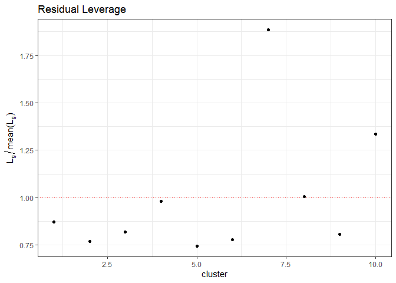
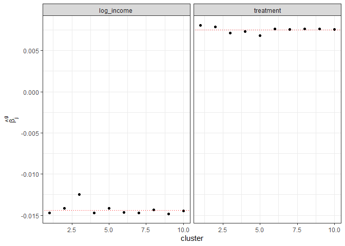

<!-- README.md is generated from README.Rmd. Please edit that file -->

# summclust

<!-- badges: start -->

[](https://github.com/s3alfisc/summclust/actions)
<!-- badges: end -->

R module for cluster level measures of leverage and influence.

For a very detailed description see:

[MacKinnon, J.G., Nielsen, M.Ø., Webb, M.D., 2022. Leverage, influence,
and the jackknife in clustered regression models: Reliable inference
using summclust](https://arxiv.org/abs/2205.03288). QED Working Paper
1483. Queen’s University.

A standalone R implementation of the cluster jackknife estimator
discussed in MNW is implemented in the [CRV3J
package](https://github.com/s3alfisc/CRV3J).

## Installation

You can install the development version of summclust from
[GitHub](https://github.com/) with:

``` r
# install.packages("devtools")
devtools::install_github("s3alfisc/summclust")
```

## Example

``` r
library(summclust)
library(fwildclusterboot)
library(fixest)

set.seed(98765)
# few large clusters (around 10000 obs)
N <- 100000
N_G1 <-10
data <- fwildclusterboot:::create_data(
    N = N,
    N_G1 = N_G1,
    icc1 = 0.8,
    N_G2 = 10,
    icc2 = 0.8,
    numb_fe1 = 10,
    numb_fe2 = 10,
    seed = 12
  )

feols_fit <- feols(
  proposition_vote ~ treatment  + log_income |Q1_immigration + Q2_defense, 
  cluster = ~group_id1 , 
  data = data
)

summclust_res <- summclust(
  obj = feols_fit, 
  cluster = data$group_id1, 
  type = "CRV3J")

plot(summclust_res)
#> $residual_leverage
```



    #> 
    #> $coef_leverage


