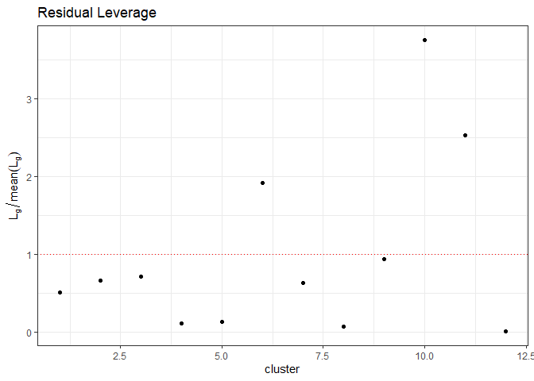
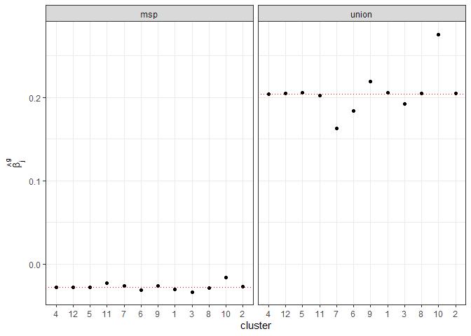

<!-- README.md is generated from README.Rmd. Please edit that file -->

# summclust

<!-- badges: start -->

[](https://github.com/s3alfisc/summclust/actions)
<!-- badges: end -->

R module for cluster level measures of leverage, influence, and a
cluster jackknife variance estimator.

For a very detailed description of the implemented methods, see:

[MacKinnon, J.G., Nielsen, M.Ø., Webb, M.D., 2022. Leverage, influence,
and the jackknife in clustered regression models: Reliable inference
using summclust](https://arxiv.org/abs/2205.03288). QED Working Paper
1483. Queen’s University.

For the Stata version of the package, see
[here](https://github.com/mattdwebb/summclust).

## Installation

You can install the development version of summclust from
[GitHub](https://github.com/) with:

``` r
# install.packages("devtools")
devtools::install_github("s3alfisc/summclust")
```

## Using `summclust`

``` r
library(summclust)
library(lmtest)
library(haven)

nlswork <- read_dta("http://www.stata-press.com/data/r9/nlswork.dta")
# drop NAs at the moment
nlswork <- nlswork[, c("ln_wage", "grade", "age", "birth_yr", "union", "race", "msp", "ind_code")]
nlswork <- na.omit(nlswork)

lm_fit <- lm(
  ln_wage ~ as.factor(grade) + as.factor(age) + as.factor(birth_yr) + union +  race + msp,
  data = nlswork)

summclust_res <- summclust(
  obj = lm_fit,
  cluster = ~ind_code,
  type = "CRV3")

# CRV3-based inference - exactly matches output of summclust-stata
coeftable(summclust_res, param = c("msp", "union"))
#>             coef     tstat         se      p_val  conf_int_l  conf_int_u
#> union  0.2039597  2.440122 0.08358587 0.03281561  0.01998847 0.387930980
#> msp   -0.0275151 -1.956404 0.01406412 0.07628064 -0.05847002 0.003439815

summary(summclust_res, param = c("msp","union"))
#>             coef     tstat         se      p_val  conf_int_l  conf_int_u
#> union  0.2039597  2.440122 0.08358587 0.03281561  0.01998847 0.387930980
#> msp   -0.0275151 -1.956404 0.01406412 0.07628064 -0.05847002 0.003439815
#>  
#>            leverage partial-leverage-msp partial-leverage-union    beta-msp
#> Min.     0.09332052          0.001622359           0.0006662968 -0.03320040
#> 1st Qu.  0.70440923          0.009133996           0.0048899422 -0.02893131
#> Median   3.51549151          0.056682344           0.0379535242 -0.02776470
#> Mean     5.41666667          0.083333333           0.0833333333 -0.02691999
#> 3rd Qu.  6.41132962          0.106083114           0.1004277711 -0.02610221
#> Max.    20.28918187          0.312994532           0.3597669210 -0.01583453
#>         beta-union
#> Min.     0.1624754
#> 1st Qu.  0.1994694
#> Median   0.2045197
#> Mean     0.2053997
#> 3rd Qu.  0.2056569
#> Max.     0.2754228
```

To plot the leverage statistics, use the `plot` method

``` r
plot(summclust_res, param = c("msp","union"))
#> $residual_leverage
```



    #> 
    #> $coef_leverage



    #> 
    #> $coef_beta


## Using `summclust` with `coefplot` and `fixest`

Note that you can also use CVR3 and CRV3J covariance matrices computed
via `summclust` with the `lmtest()` and `fixest` packages.

``` r
library(lmtest)
library(fixest)

df <- length(summclust_res$cluster) - 1

# with lmtest
CRV1 <- coeftest(lm_fit, sandwich::vcovCL(lm_fit, ~ind_code), df = df)
CRV3 <- coeftest(lm_fit, summclust_res$vcov, df = df)

CRV1[c("union", "race", "msp"),]
#>          Estimate  Std. Error   t value     Pr(>|t|)
#> union  0.20395972 0.061167499  3.334446 0.0066585766
#> race  -0.08619813 0.016150418 -5.337207 0.0002384275
#> msp   -0.02751510 0.009293046 -2.960827 0.0129561148
CRV3[c("union", "race", "msp"),]
#>          Estimate Std. Error   t value    Pr(>|t|)
#> union  0.20395972 0.08358587  2.440122 0.032815614
#> race  -0.08619813 0.01904684 -4.525586 0.000864074
#> msp   -0.02751510 0.01406412 -1.956404 0.076280639

confint(CRV1)[c("union", "race", "msp"),]
#>             2.5 %       97.5 %
#> union  0.06933097  0.338588481
#> race  -0.12174496 -0.050651302
#> msp   -0.04796896 -0.007061245
confint(CRV3)[c("union", "race", "msp"),]
#>             2.5 %       97.5 %
#> union  0.01998847  0.387930980
#> race  -0.12811995 -0.044276312
#> msp   -0.05847002  0.003439815

# with fixest
feols_fit <- feols(
  ln_wage ~ as.factor(grade) + as.factor(age) + as.factor(birth_yr) + union +  race + msp,
  data = nlswork)

fixest::coeftable(
  feols_fit,
  vcov = summclust_res$vcov,
  ssc = ssc(adj = FALSE, cluster.adj = FALSE)
)[c("msp", "union", "race"),]
#>          Estimate Std. Error   t value     Pr(>|t|)
#> msp   -0.02751510 0.01406412 -1.956404 5.043213e-02
#> union  0.20395972 0.08358587  2.440122 1.469134e-02
#> race  -0.08619813 0.01904684 -4.525586 6.059226e-06
```

The p-value and confidence intervals for `fixest::coeftable()` differ
from `lmtest::coeftest()` and `summclust::coeftable()`. This is due to a
fact that `fixest::coeftable()` uses a different degree of freedom for
the t-distribution used in these calculation (I believe it uses t(N-1)).
